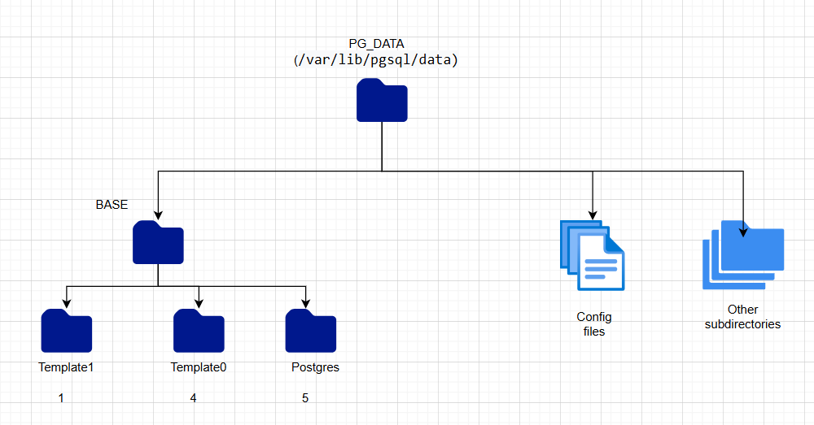
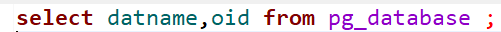
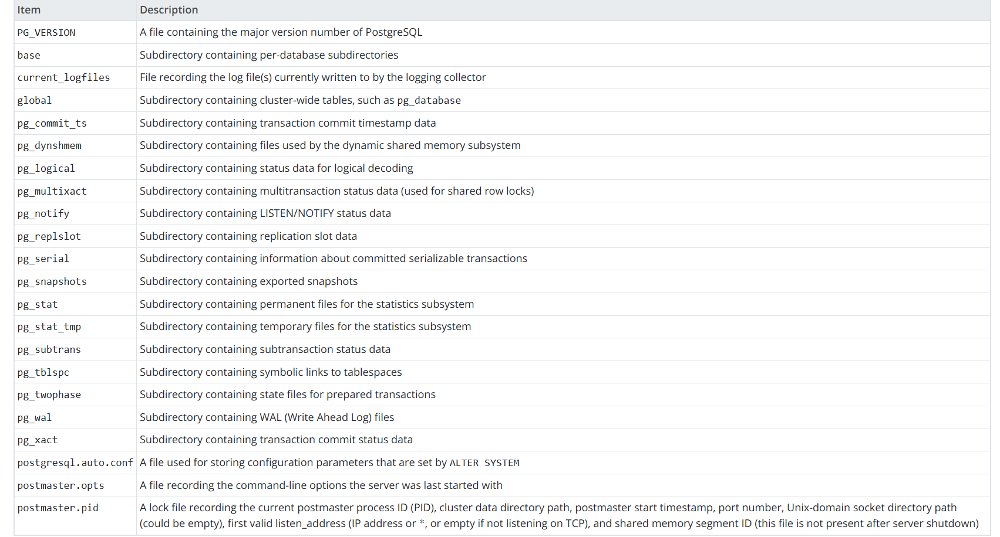

# PostgreSQL Database Cluster Notes

## What is a cluster?
A PostgreSQL cluster is a single PostgreSQL server instance that manages multiple databases.

The cluster is initialized with `initdb`.

When a new cluster is created, PostgreSQL includes these default databases:
- `postgres`
- `template1`
- `template2`

## Cluster data location
`PGDATA` is the environment variable that points to the cluster data directory.

Inside `PGDATA`, you will find:
- `base/`: database-specific files (one subdirectory per database, named by OID)
- `global/`: cluster-wide system catalog files (for example metadata such as `pg_database`)
- configuration files
- WAL and other internal directories



_Figure: High-level layout of `PGDATA` and default database folders._

## OID basics
An OID (Object Identifier) is a unique numeric identifier assigned to PostgreSQL objects such as databases, tables, and indexes.

Many on-disk folder/file names in `PGDATA` use OIDs.

Example query to list database names and OIDs:

```sql
SELECT datname, oid FROM pg_database;
```



_Figure: Example query to inspect database OIDs._

## Important files and directories in `PGDATA`



_Figure: Quick reference of common files/directories found in `PGDATA`._

### `PG_VERSION`
Contains the major PostgreSQL version for the whole cluster.

All databases stored under `base/` must match this cluster version.

### `current_logfiles`
A temporary file generated when the PostgreSQL logging collector is enabled.

It points to the currently active log file(s) used for errors, connections, and slow query logs.

In many Docker setups, this file may be absent or less relevant because logs are routed to the container runtime and viewed with commands like `docker logs`.

### `global/`
Shared cluster-wide area containing global catalog data and control information.

This includes data related to global system tables (such as `pg_database`) and control state (for example in `pg_control`, used for cluster/WAL state tracking).

### `pg_commit_ts/`
Stores transaction IDs with their commit timestamps when `track_commit_timestamp` is enabled.

It is disabled by default because enabling it adds CPU, memory, and disk overhead.
